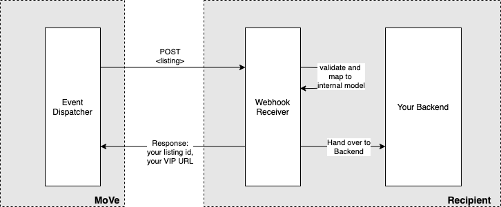
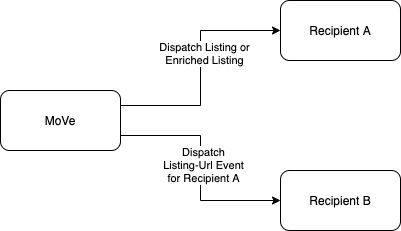

 
[Github Home](https://github.com/tastybug/reference-move-webhook-receiver/)

# Reference MoVe Webhook Receiver Implementation

You are the developer of an organisation that plans to receive data from eCG Motors Vertical, "MoVe". You are tasked with setting up a service that will receive event payloads like listings, promotions, dealer data and so on.
This kind of integration is done using a webhook contract: MoVe defines certain payload structures and expects a recipient to provide remote endpoints via which these payloads can be handed downstream. More on the event types and payloads down below.

This repository contains a reference webhook receiver implementation in plain Java using Spring Boot to pull in a number of required dependencies. You can use this as a baseline for your own internal development or just to see how certain things can be handled.

## Setting up shop as a developer
### Building

This project utilizes gradle, you can build it using `./gradlew clean build`. During build time, a number of payload types are generated for you based on the public MoVe API spec, e.g. `Listing.java`. Each of these payload types comes with helpful descriptions and, where applicable, with value ranges that you can expect.

In your IDE make sure to enable annotation processing.

### Running locally

The service is stateless and can be started locally by running `./gradlew clean bootRun`, after which you can open <http://localhost:8080/swagger-ui.html>.

This will open Swagger UI, which is a simple REST client that you can use to publish events into the service and see how it reacts.

At the bottom of the page your can browse through the MoVe API model, complete with examples, validation rules and description of semantics. Make sure to check those out to map incoming data to your internal model.

## Event Types

MoVe is able to hand over a number of different events around the main business entities: listings, dealers and promotions.
Speak to the MoVe integration team to negotiate which events you want to receive. Following you will find a short description of each event type and pointers into the implementation.

| Event Type | Json Payload Example | Type Class | Integration Test Example | Controller Example Impl |
| -------------- | --------- | ---------- | ---------- | ---------- |
| Listings | [real-listing-event.json](./src/test/resources/webhook/real-listing-event.json) | [Listing.java](./build/gen-sellermodel/src/gen/java/ecg/move/sellermodel/listing/Listing.java) | [ListingEventIntegrationTest.java](./src/test/java/org/example/move/webhookreceiver/rest/ListingEventIntegrationTest.java) | [ListingReceiverController.java](./src/main/java/org/example/move/webhookreceiver/rest/listing/ListingReceiverController.java) |
| Dealers | [real-dealers-event.json](./src/test/resources/webhook/real-dealers-event.json) | [DealerLogMessageV2.java](./build/gen-sellermodel/src/gen/java/ecg/move/sellermodel/dealer/DealerLogMessageV2.java) | [DealerEventIntegrationTest.java](./src/test/java/org/example/move/webhookreceiver/rest/DealerEventIntegrationTest.java) | [DealerReceiverController.java](./src/main/java/org/example/move/webhookreceiver/rest/dealer/DealerReceiverController.java) |
| Promotions | TODO | TODO | TODO | TODO |
| Enriched Listings | [real-enriched-listing-event.json](./src/test/resources/webhook/real-enriched-listing-event.json) | [EnrichedListingEvent.java](./src/main/java/org/example/move/webhookreceiver/rest/listing/EnrichedListingEvent.java) | [ListingEventIntegrationTest.java](./src/test/java/org/example/move/webhookreceiver/rest/ListingEventIntegrationTest.java) |  [ListingReceiverController.java](./src/main/java/org/example/move/webhookreceiver/rest/listing/ListingReceiverController.java) |
| Listing-Urls | [real-listing-url-event.json](./src/test/resources/webhook/real-listing-url-event.json) | [ListingUrl.java](./build/gen-sellermodel/src/gen/java/ecg/move/sellermodel/webhook/ListingUrl.java) | [ListingUrlEventIntegrationTest.java](./src/test/java/org/example/move/webhookreceiver/rest/ListingUrlEventIntegrationTest.java) | [ListingUrlReceiverController.java](./src/main/java/org/example/move/webhookreceiver/rest/listingurl/ListingUrlReceiverController.java) |

### Listings
Listings are the central business entities within MoVe. They describe an item using a number of properties (e.g. an "Audi A4" with its exterior color, type of gearbox etc.). They also contain a reference to the seller, pricing information and other relevant data.

> Whenever a listing event is being sent, MoVe expects a synchronous response containing 2 things: 
> * the listing id that the recipient assigned
> * one consumer facing VIP URL per supported language that MoVe will use to point to the listing in the recipients system

### Dealers

Dealers are commercial sellers. You can receive events for changes around a dealer entity like contact detail changes, subscription changes as well as lifecycle changes (like onboarding / offboarding).

### Promotions

Promotions are applied to listings to increase their visibility. Promotions are very simple entites: they reference the listings to which they apply, the type of promotion and a flag for whether the promotion is active or not.

**This is currently not covered.**

### Enriched Listings

Enriched listings are a composite of the upper 3 events. They contain a listing, all listing related promotions and, if it is a dealer listing, the dealer document. You will receive this event in full whenever one of the subdocuments changed.

> Like with the listing event type, you are supposed to return your local listing id back as well as VIP URLs.

### Listing-Url

MoVe Listings are dispatched to a variety of different receivers. In the Canadian tenant, this can include Kijiji.ca, kijijiautos.ca and others. If you are interested in knowing to which marketplaces a listing or enriched listing has been dispatched, subscribe to the `listing-url` event.
This tells you the marketplace, the local listing id as well as the VIP URLs of the listing in that marketplace.

