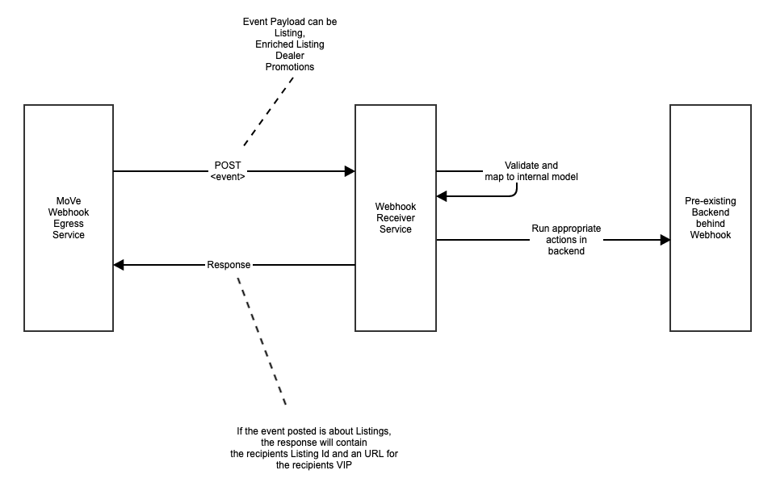
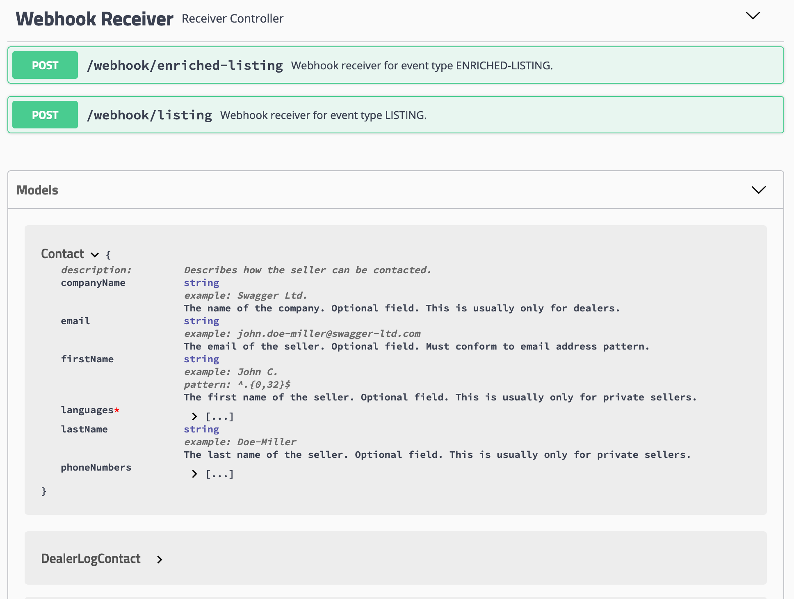

 [Github Home](https://github.com/tastybug/reference-move-webhook-receiver/)

# Reference MoVe Webhook Receiver Implementation

Organisations that plan to receive Listing, Dealer and Promotional data from MoVe are required to set up a Webhook recipient service which is able to process incoming requests according to the technical contract.

This repository contains a reference Webhook receiver implementation in Java / Spring Boot. You can use this as a baseline for your own internal development or to see what details this involves.

### How to build this

This project utilizes gradle, you can build it using `./gradlew clean build`. The build process will generate a number of helpful payload types for incoming data, e.g. `Listing.java` which comes with extensive descriptions of listing properties.

In your IDE make sure to enable annotation processing; you possibly need a Lombok plugin.

### How to experiment with this

The service is stateless and can be started locally by running `./gradlew clean bootRun`, after which you can open <http://localhost:8080/swagger-ui.html>.

This will open Swagger UI, which is a bare bone REST client that you can use to publish events into the service and see how it reacts.

At the bottom of the page your can browse through the MoVe API model, complete with examples, validation rules and description of semantics. Make sure to check those out to map incoming data to your internal model.

